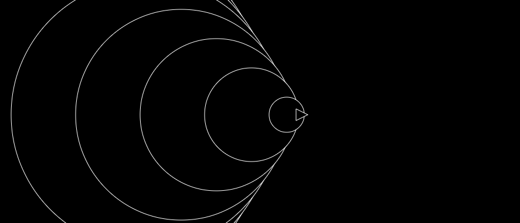

# Sonic boom

Experiment to illustrate a sonic boom and experiment with JS.

To change the speed of the object, change `v` in [sonicboom.js](./sonicboom.js):

```let v = v_wave*1.2;```

In this case, the object moves at mach 1.2, 20% faster than the speed of sound.

